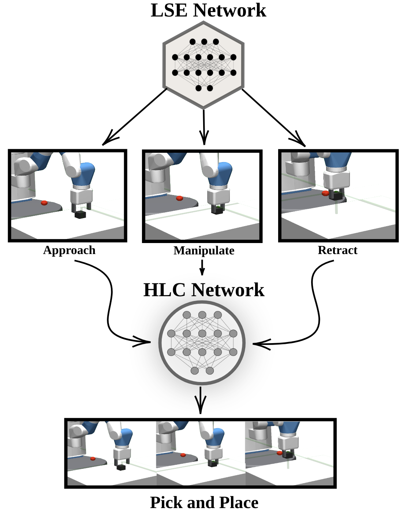
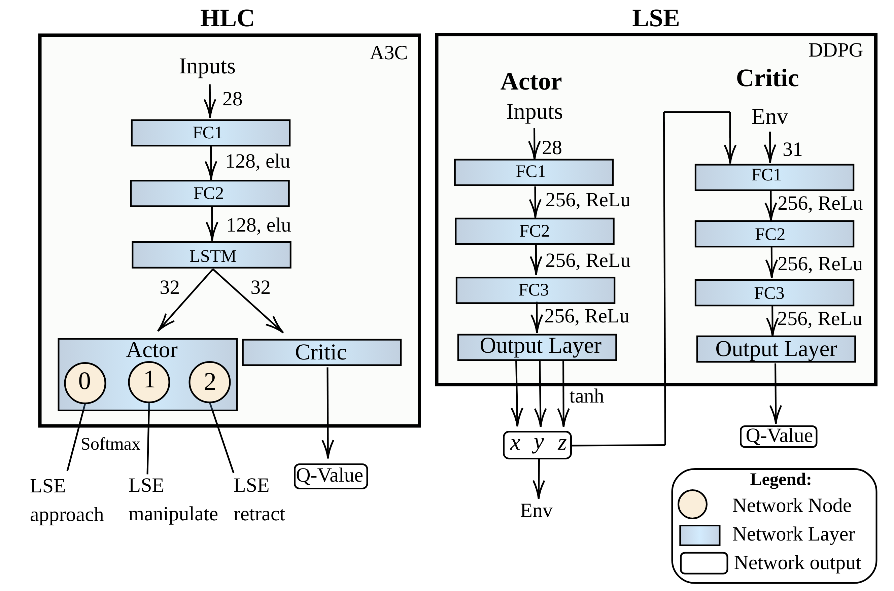

# Towards Hierarchical Task Decomposition using Deep Reinforcement Learning for *Pick and Place* Subtasks

**https://arxiv.org/abs/2102.04022 [Luca Marzari](https://github.com/LM095) et. al.**

## Abstract

Framework Proposed                       |  Architecture
:---------------------------------------:|:-------------------------:
  |  


Robotic learning using  Deep Reinforcement learning (DRL) has emerged as a leading robotic automation technique to generate adatible behaviour.
However, a major drawback of using DRL is the *data hungry* training regime that requires millions of trial and error attempts, impractical in real robotic hardware. We propose a multi-subtask reinforcement learning method where complex tasks can be decomposed into low-level subtasks. These subtasks can be parametrized as expert networks and learnt via existing DRL methods. The trained subtasks can be sequenced with a high-level choreographer. As a testbed, we use a pick and place robotic simulator, and transfer the learnt behaviours in a real robotic system. We show that our method outperforms imitation learning based methods and reaches high success rate compared to an end-to-end learning approach. All our experiments are carried out on a CPU-based system that demonstrate their rapid deployment in simple computing systems, contrary to commonly used heavy processing machines such as GPU. Our approach deviates from the end-to-end learning strategy and provides an initial direction towards learning modular task representations that can generate robust and transferable behaviours.


## Implementation details
### Prerequisites
- Python3.7+
- PyTorch==1.0.0
- mpi4py
- OpenAI gym==0.17.1 (base with some changes)
- OpenAI gym==0.10.8
- mujoco physics engine

Here, we used the OpenAI simulator *FetchPickandPlace-v1* which provides a kinematic state vector as an input to our network.
For installing OpenAI fetch simulator: refer to [Fetch](https://openai.com/blog/ingredients-for-robotics-research/)

Since a hierarchical task decomposition is used, there are two different goals during the same episode: one is the final goal of the whole episode, which is where to place the block, and the other one changes based on which subtask we want to train.

In order to use a dense reward and obtain good results, we modified the original OpenAI gym's *step* function, which determines for each action perform to the environment, the next state, the reward obtained for that action, and if we reach the episode goal.
Basically our new *env.step()* function now requires two parameters, the action to be taken in the environment (as before), but also what is the goal that the agent is trying to achieve.
In case of approach, the goal will be a position slightly above the block as mentioned before, for manipulate will be the base of the object to grasp, and finally for retract the goal will be the point where we want to place the object

If you want train the agent with our method you need to replace the base gym with the gym in this repository: `Multi-Subtask-DRL-for-Pick-and-Place-Task/gymModified`

### Clone the repository

```
git clone https://github.com/LM095/Multi-Subtask-DRL-for-Pick-and-Place-Task
cd Multi-Subtask-DRL-for-Pick-and-Place-Task
```
### Step 0: Train e2e and BC
For a good end-to-end implementation of DDPG+HER PyTorch implementation you can refer to this repository: https://github.com/TianhongDai/hindsight-experience-replay

For the subtask approach with imitation learning method (BC) check this repo:
https://github.com/cvas-ug/simple-reactive-nn


### Step 1: Train the Low-level Subtask Expert (LSE) 

- Use Gym==0.17.1 modified.
- replace your original gym folder with the one present in this repository. Usually, if you are using anaconda you can find your gym at this path:
```
~/anaconda3/lib/python3.7/site-packages/gym
```
- rename your gym folder to whatever name you prefer and place the new gym folder copied from this repository and change the name from "gymModified" to "gym".
- For all the subtasks training you can stop the training after two consecutive high success rate. For the plot reported in the results section, we stopped approach training after 9 epochs, manipulate after 2 epochs and retract after 6 epochs.

#### Train Approach LSE 
- Go to the folder named "fetchPickAndPlace-DDPG+HER"
- Go to the folder named 'rl_modules' and change the name "ddpg_agent_approach.py" into "ddpg_agent.py"
- Go back to "fetchPickAndPlace-DDPG+HER"  folder and run the program:
```
mpirun -np 1 python -u train.py --env-name='FetchPickAndPlace-v1' 2>&1 | tee pick.log
```

#### Train Manipulate LSE 
- Go to the folder named 'rl_modules' in the cloned directory and change the name "ddpg_agent.py" in "ddpg_agent_approach" and "ddpg_agent_manipulate.py" into "ddpg_agent.py"
- Go back to "FetchPickAndPlace-DDPG+HER"  folder and run the program:
```
mpirun -np 1 python -u train.py --env-name='FetchPickAndPlace-v1' 2>&1 | tee pick.log
```

#### Train Retract LSE 
- Go to the folder named 'rl_modules' in the cloned directory and change the name "ddpg_agent.py" in "ddpg_agent_manipulate" and "ddpg_agent_retract.py" into "ddpg_agent.py"
- Go back to "FetchPickAndPlace-DDPG+HER"  folder and run the program:
```
mpirun -np 1 python -u train.py --env-name='FetchPickAndPlace-v1' 2>&1 | tee pick.log
```


## Train the High-Level Synthesizer (HLS):
- Use your original Gym==0.10.8.
- Transfer the saved weights from the "saved_models" folder of "FetchPickAndPlace-DDPG+HER" into the "HLS" folder (replace the folder if asked)
- In the "init Weights" folder there are some weights collected from BC subtasks training. If you want to test HLS with BC methods, copy the file in the "initWeights" folder in to "train" and "weights" folders.
- In the "HLS" folder you can choose different methods to train HLS: `dense_rewardHandEng`,`sparse_rewardHandEng`,`dense_reward_BC`,`sparse_reward_BC`, `dense_rewardDDPG_HER`,`sparse_rewardDDPG_HER`
 
 Dense/sparse reward HandEng it's the training of an agent that has to learn how to choreograph hand engineering actions. Dense/Sparse reward BC it's the training of an agent that has to learn how to choreograph low-level behaviors trained with BC and similar for DDPG+HER.

To train HLS with one of these methods just copy the name and past it in `main.py` file at line 17 
```python=17
from dense_rewardDDPG_HER import train, test
```
 For the results presented below, we used `dense_rewardDDPG_HER`/`dense_reward_BC`
 
- Run the program:
```
python main.py
```

## Adaptive behavior
One of the hypotheses of this study lies in reusing a subset of the acquired representations gained on one task and generalize it to an unseen similar task. To investigate this hypothesis, we conduct one experiment: we use the approach subtask (weights of the approach  LSE network) trained on the *FetchPickAndPlace* task as an apriori knowledge to learn the *FetchPush* task with DDPG + HER.
- Use your original Gym==0.10.8.
- go to folder "DDPG+HERe2e-PriorKnowledge"
- in the folder "saved_models/FetchPush-V1" you will find already the approach weights file, if you have trained your agent in Step 1 replace this file with yours and rename it "approach".
- run the program (for our results we use 6 mpi):
```
mpirun -np 6 python -u train.py --env-name='FetchPush-v1' 2>&1 | tee pick.log
```


## Results:

### LSE training:
The figure presented here below depicts the sample-efficiency of DDPG+HER, BC and a end-to-end learning method for learning the subtasks.The peak represents the maximum success reached by each method for each subtask, i.e. first peak denotes the completion of training of the approach module, the second peak denotes completion of  training  of  the manipulate  module  and the third  peak  denotes  training of  retract module.
DDPG+HER outperforms BC and reaches 100% success in 255k steps, while BC takes 372k steps. Moreover, DDPG+HER shows a smooth monotonous learning curve compared to BC which does not stabilise immediately after reaching high success values. Overall, DDPG+HER shows less variance compared to BC.


## Robotic Part:
For the robotic implementation and for panda-gym integration with real robot check this repo https://github.com/Envq/panda_gym_integration.
This part of the work was made by **Enrico Sgarbanti** [@**Envq**](https://github.com/Envq) of University of Verona.

## Citation

Towards Hierarchical Task Decomposition using Deep Reinforcement Learning for Pick and Place Subtasks:  
```
@article{subtaskDRL2021,
  author={Luca Marzari and Ameya Pore and Diego Dall'Alba and Gerardo Aragon-Camarasa and Alessandro Farinelli and Paolo Fiorini},
  title={Towards Hierarchical Task Decomposition using Deep Reinforcement Learning for Pick and Place Subtasks},
  year={2021},
  url={https://arxiv.org/abs/2102.04022},
  archivePrefix={arXiv:2102.04022 [cs.RO]},
  eprint={}
}
```
